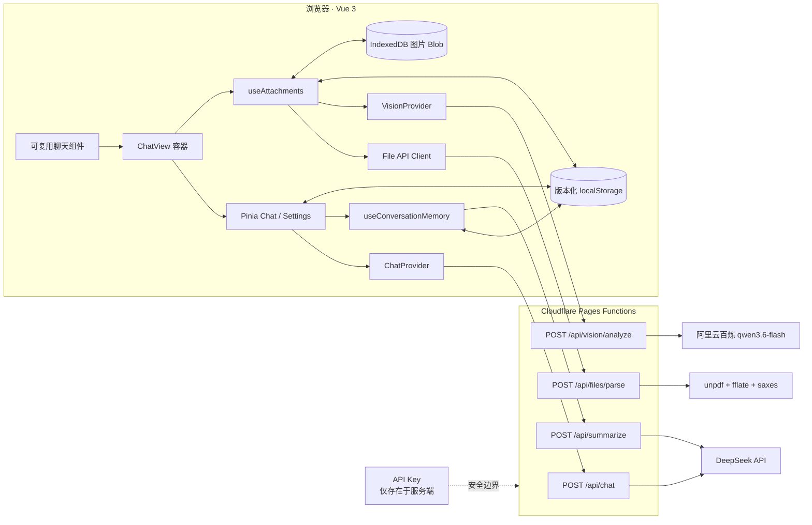

# DebugDiva v2

DebugDiva v2 是一个基于 Vue 3、TypeScript、Pinia 和 Cloudflare Pages Functions 的 AI 对话应用。前端负责流式交互、附件状态和本地数据管理，服务端统一编排 DeepSeek、文档解析与千问图片理解能力。

项目采用可替换 Provider、统一消息协议和明确的前后端安全边界，并通过浏览器持久化与自动化测试保证复杂交互的可维护性。

## 技术设计

- Vue 3、TypeScript、Pinia 与 Composition API，组件边界清晰。
- `ChatWindow`、`MessageList`、`MessageItem`、`MessageContent`、`ChatComposer` 只通过 Props / Events 协作，不直接访问 API 或 localStorage。
- 统一 `ChatMessage` / `MessageContent` 协议，支持 text、file、image、citation。
- DeepSeek SSE 增量解析支持任意 UTF-8 chunk 边界、CRLF、keep-alive、usage、`[DONE]`、异常 JSON 和意外 EOF。
- 停止生成保留部分内容；仅在尚未输出内容时对可重试 5xx 自动重试一次。
- Chat / Vision Provider 抽象与服务端模型白名单，浏览器只能提交 `fast`、`deep`、`quality`。
- 文本、PDF、DOCX 在 Pages Function 中解析；原始文件不进入 localStorage。
- 用户发送图片问题后，后台由千问 `qwen3.6-flash` 提取描述、OCR 和对象信息，再把纯文本结果交给 DeepSeek；界面只展示最终回答。
- 长对话使用结构化摘要 + 最近消息，摘要失败不阻塞当前聊天。
- 版本化 localStorage、IndexedDB 原图存储、容量保护和跨会话孤儿附件回收。
- 统一错误协议、`requestId`、超时、取消和脱敏日志，服务端不记录完整提示词或文件正文。
- 会话 ZIP 导出和“清除全部本地数据”，导出使用严格字段白名单并只打包当前会话原图。

## 支持范围

| 能力 | 当前实现 |
| --- | --- |
| 文本聊天 | DeepSeek SSE、Markdown、代码高亮、停止、重试、重新生成 |
| 模型模式 | 快速回答、深度思考、高质量；服务端固定映射模型和 thinking 参数 |
| 文档 | 常见文本 / 代码文件、PDF、DOCX；服务端提取纯文本 |
| 图片 | JPEG、PNG、WebP；千问 `qwen3.6-flash` 描述、OCR、对象识别 |
| 长对话 | 结构化摘要、最近消息窗口、后台更新、失败回退 |
| 本地数据 | 会话、设置、解析结果、摘要；导出、清理和容量保护 |
| 图片生成 | 不支持；明确生图请求在本地固定回复“暂且没有提供图像生成功能” |

## 架构



四条主要数据流：

1. 聊天：组件事件 → Pinia → `DeepSeekChatProvider` → `/api/chat` → SSE 增量渲染。
2. 文档：浏览器临时上传原文件 → `/api/files/parse` → 返回提取文本 → 作为附件上下文注入聊天。
3. 图片：浏览器选择原图并输入问题 → 消息接受后保存原图到 IndexedDB 并清空输入区 → 调用 `/api/vision/analyze` → 千问返回结构化文字分析 → DeepSeek 只接收文字并生成最终回答；历史图片可点击放大。
4. 摘要：对话超过阈值后后台调用 `/api/summarize`；下一轮上下文按“能力指令 → 摘要 → 激活附件 → 最近消息”组装。

## 目录与职责

```text
src/components/chat/                 可复用展示组件，只使用 Props / Events
src/features/chat/ChatView.vue       Pinia、浏览器副作用与组件的薄容器
src/providers/                       Chat / Vision Provider 实现
src/composables/                     附件与长对话记忆编排
src/services/context/                上下文、摘要与附件文本组装
src/services/storage/                版本化持久化、校验与容量保护
src/services/export/                 会话安全导出
src/store/                            会话和设置状态机
functions/api/                       四个 Cloudflare Pages Functions
functions/_shared/                   模型映射、解析器、视觉与 API 生命周期
```

## 本地开发

建议使用 Node.js 22+ 和 pnpm 10+。`unpdf` 当前版本要求 Node.js 22。

```bash
pnpm install --frozen-lockfile
```

复制 `.env.example` 为 `.env.local`，填写服务端配置：

```env
DEEPSEEK_API_KEY=your_api_key
DEEPSEEK_BASE_URL=https://api.deepseek.com

DASHSCOPE_API_KEY=your_server_only_api_key
DASHSCOPE_BASE_URL=https://dashscope.aliyuncs.com/compatible-mode/v1
```

启动开发服务器：

```bash
pnpm dev
```

Vite 中间件复用生产 Function 的校验和错误协议。所有密钥只在本地 Node 进程读取；`envPrefix` 已设为 `PUBLIC_`，项目代码不会从浏览器模块读取密钥。不要把密钥改成 `VITE_*` 或 `PUBLIC_*` 变量。

常用校验命令：

```bash
pnpm typecheck
pnpm test
pnpm build
git diff --check
```

自动测试使用模拟 Provider 和 fetch，不会调用真实服务。

## 服务端接口

| 接口 | 请求 | 作用 |
| --- | --- | --- |
| `POST /api/chat` | JSON：messages、mode、匿名 clientId | 校验并安全映射模式，代理 DeepSeek SSE |
| `POST /api/files/parse` | multipart：file | 解析文本、PDF、DOCX，返回纯文本和元数据 |
| `POST /api/vision/analyze` | multipart：file、task、prompt | 校验图片和用户问题并调用千问 `qwen3.6-flash` |
| `POST /api/summarize` | JSON：精简消息、previousSummary、匿名 clientId | 使用固定快速模式生成结构化摘要 |

统一错误体：

```json
{
  "error": {
    "code": "UPSTREAM_UNAVAILABLE",
    "message": "AI 服务暂时不可用",
    "requestId": "8d8f...",
    "retryable": true
  }
}
```

`X-Request-Id` 响应头与错误体一致。服务端日志只允许 `requestId`、耗时、状态、模式和 usage，不记录提示词、文件内容、密钥、堆栈或供应商完整错误正文。

## localStorage、导出与隐私

项目使用以下版本化键：

```text
debugdiva:sessions:v2
debugdiva:settings:v1
debugdiva:attachment-results:v1
debugdiva:summaries:v1
```

- localStorage 不保存原始 `File`、Blob、Object URL、图片 Base64 或 API Key；已发送图片的原始 Blob 仅保存在 `debugdiva` IndexedDB 的 `image-blobs` 仓库。
- 刷新后会从 IndexedDB 重建图片 Object URL；文档提取文本和内部图片理解缓存继续保留，界面不展示视觉模型的中间结果。
- 会话加载失败时保留源键原始值，不用空数据覆盖关联摘要或附件记录。
- localStorage 是当前浏览器、当前设备的数据，不是账户云存储，也不会跨设备同步。
- 会话统一导出 ZIP，包含 `conversation.json` 和当前会话可恢复的 `images/` 原图；仍可能包含聊天正文、推理文本、文档提取内容和 OCR，分享前应自行检查。
- “清除全部本地数据”只删除 DebugDiva 自己的 localStorage 键并清空图片仓库，不调用 `localStorage.clear()`，且操作不可撤销。

## 可靠性与安全设计

- 浏览器只发送 `mode`，模型名、thinking 和 reasoning effort 在服务端白名单映射。
- Chat / Vision 最长 60 秒；Summary 最长 20 秒；文件解析另有页级 deadline。
- 页面只允许一个聊天请求；Chat、文件解析和视觉分析分别管理 AbortController。
- 无输出的可重试 5xx 最多自动重试一次；已有输出后断流保留部分文本并显示错误。
- 服务端校验 Content-Type、请求大小、消息数量、角色、文本、文件 magic bytes、图片尺寸和模型模式。
- SSE 只有收到 `[DONE]` 才完成；意外 EOF 会变成 `STREAM_PARSE_FAILED`。
- 存储和导出均使用字段白名单，防止运行时对象或扩展字段泄漏。
- 匿名 clientId 不包含邮箱、手机号等身份信息。当前没有宣称或实现严格的分布式限流。

## 部署

Cloudflare Pages 的构建、Functions 和服务端配置见 [部署说明](docs/deployment.md)。

## 已知限制

- 不支持图片生成、图片编辑或图生图；相关请求在浏览器本地固定拒答。
- 不提供登录、跨设备同步、R2 永久文件存储、Vectorize / RAG 或工具自动执行。
- 每条消息最多 3 个附件；单文件最大 10MB。
- 文档单文件最多提取 40,000 字符，激活附件文本合计最多 80,000 字符。
- PDF 最多 50 页；扫描 PDF 没有专业 OCR；加密文档、XLSX、PPTX、ZIP / RAR 不支持。
- DOCX 仅提取主要 XML 文本，展开 XML 上限 5MB，不处理宏、图片或外链。
- 图片仅支持 JPEG / PNG / WebP；最大边长 4096，总像素不超过 16,777,216；不支持 GIF。
- 仅已发送图片的原图会写入 IndexedDB；旧会话没有原图时显示“图片暂不可预览”，导出时只保留图片元数据。
- 图片原图不设置额外的应用级总容量，实际可用空间受浏览器配额和用户设备限制。
- 会话约 4MB、附件解析结果约 2MB、摘要约 512KB、设置约 16KB，达到上限后需导出并清理。
- Cloudflare `request.formData()` 在请求缺少可信 `Content-Length` 时会先解析 multipart，再按 `File.size` 二次拒绝；生产环境仍依赖平台请求上限作为第一道保护。
- 当前前端主包仍较大，Vite 构建会提示 chunk 超过 500KB；后续可按路由和 Markdown / 解析依赖做按需加载。

## 测试

测试覆盖 SSE parser、模型映射、上下文过滤、存储校验与恢复、附件解析、视觉结果、摘要规划、组件事件、完整 Pinia 流程、会话导出和本地数据清理。应用级 smoke 测试为未知路由安装 fetch guard，确保不会误调用真实 API。
